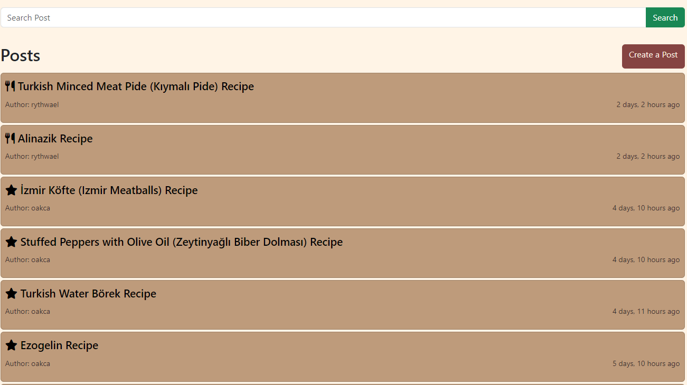
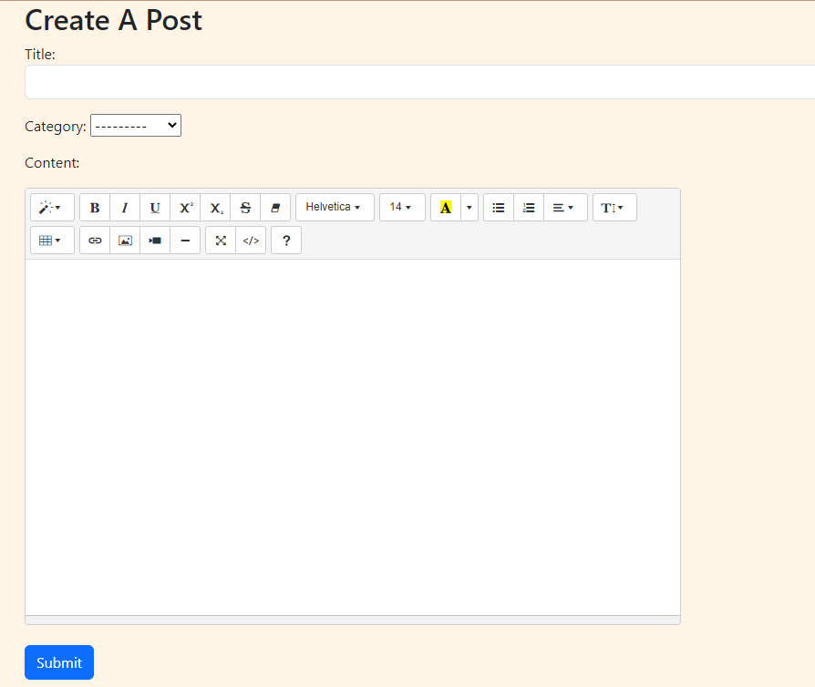
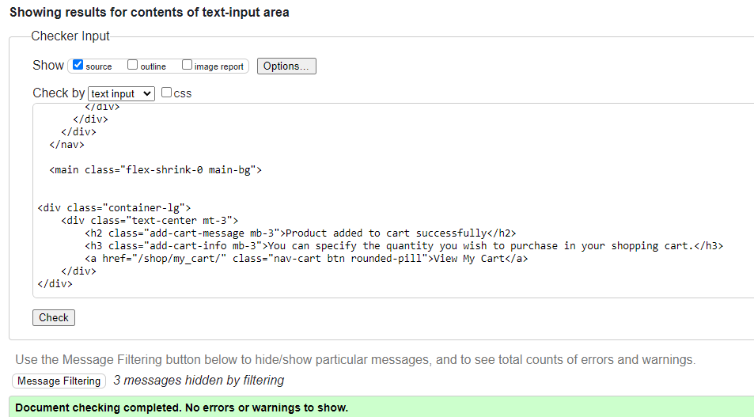
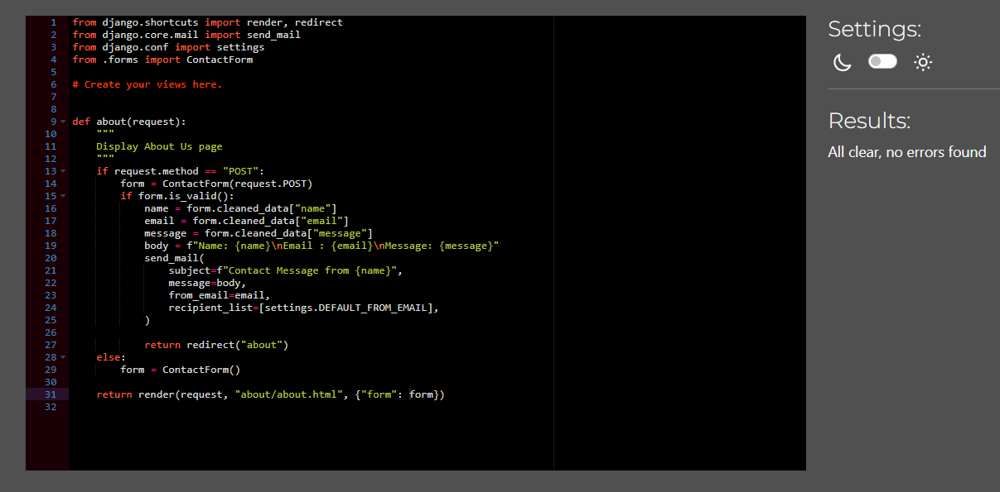
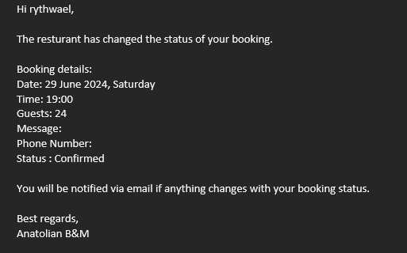
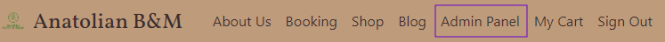

# Anatolian Bistro & Market

***Oğuzhan Akça***

💻 [Visit live website](https://anatolian-bm-0079c230f935.herokuapp.com/)  
(Ctrl + click to open in new tab)

## Table of Contents
  - [About](#about)
  - [User Goals](#user-goals)
  - [Site Owner Goals](#site-owner-goals)
  - [User Experience](#user-experience)
  - [User Stories](#user-stories)
  - [Design](#design)
    - [Colours](#colours)
    - [Fonts](#fonts)
    - [Structure](#structure)
      - [Website pages](#website-pages)
      - [Database](#database)
    - [Wireframes](#wireframes)
  - [Technologies Used](#technologies-used)
  - [Features](#features)
  - [Validation](#validation)
  - [Testing](#testing)
    - [Manual testing](#manual-testing)
    - [Device & Browser compatibility](#device-testing--browser-compatibility)
  - [Bugs](#bugs)
  - [Heroku Deployment](#heroku-deployment)
  - [Credits](#credits)
  - [Acknowledgements](#acknowledgements)

### About

Anatolian Bistro & Market is a fictional Turkish restaurant where users can book a table, read the blog and can also buy some Turkish products.

### User Goals

- Booking a table
- Finding a restaurant that offers good food and nice atmosphere.
- Find location and contact address of the restaurant
- Reading Blog
- Purchasing products from market

### Site Owner Goals

- Allowing users to book table online
- Showing and selling their available products
- Providing users an application that easy to navigate
- Promote the business
- Fully responsive and accessible

## User Experience

### Target Audience
- Users who wants to book a table easily
- People looking for a place to have dinner
- Users who wants to purchase turkish products
- Users who wants to share their idea and opinions
- Users who wants to taste of Turkish Cuisine

### User Requirements and Expectations

- Fully responsive
- Accessible
- A welcoming design
- Contact information
- Accessibility
- Design and content that will not tire the reader's eyes
- Links that work as they should

## User Stories

### Users

1. As a User, I want to use navigation so that I can navigate through website easily.
2.	As a User, I want to make a reservation online so that I can ensure a table is available when I visit.
3.	As a User, I want to find social accounts of business so that I can visit their accounts.
4.	As a User, I want to find a contact us page so that I can get in touch with business.
5.	As a User, I want to view the opening hours and contact details so that I know when the business is open and how to contact them via phone and socials.
6.	As a User, I want to book a table selecting a date and time so that I can reserve my table.
7.	As a User, I want to add additional informations to my booking so that business can be prepared better.
8.  As a User, I want to list my bookings so that I can see when did i book last time.
9. As a User, I want to get informed when my booking status changed so that I know if its cancelled or not.
10. As a User, I want to make an account so that I can use all the features.
11. As a User, I want to login so that I can book a table.
12. As a User, I want to reset my password once i forget.
13. As a User, I want to view the site's blog so that I can learn additional information and read articles.
14. As a User, I want to search posts so that I can find the post i want faster.
15. As a User, I want to post on blog.
16. As a User, I want to edit or delete my post.
17. As a User, I want to comment on posts.
18. As a User, I want to search and filter products.

### Admin
19.	As an Admin, I want to log in so that I can access the back end of the site.
20.	As an Admin, I want to add and remove products.
21. As an Admin, I want to accept or reject bookings so that I can avoid double bookings.
22. As an Admin, I want to add,read, update and remove posts.
23. As an Admin, I want to add,read, update and remove comments.

### Site Owner  
24. As a Site Owner, I can provide a fully responsive site for my customers so that they have a good user experience.
25. As a Site Owner, I can validate data entered into my site so that all submitted data is correct to avoid errors.
26. As a Site Owner, I can provide information about my business.

### Kanban, Epics & User Stories
- GitHub Kanban was used to track user stories
- Epics were created using the milestones feature
- Todo, In Progress, Done headings were used in the kanban

Epics

User Stories

Kanban

## Design

### Colours

For the color theme, I used restaurant logo's background color as the reference. After some research I decided to use the Cappucino Color Palette which fits pretty good with restaurant's logo.

The colors I wanted to stay close to  [Cappucino Color Palette](https://www.color-hex.com/color-palette/389)

See colour pallet

### Fonts

Vollkorn, PT Sans, Oswald and Abril Fatface fonts used from [Google Fonts](https://fonts.google.com/)

### Structure

#### Website pages

The site was designed for the user to be familiar with the layout such as a navigation bar along the top of the pages and a dropdown menu button for smaller screen.

The footer contains all social media links that the business has so the user can visit any social media site and follow the business there to expand the businesses followers, likes and shares.

- The site consists of the following pages:
  - Homepage : Welcomes users and shows the features of the website.
  - About Us : Gives information about business, its history. Also contains contact addresses and form.
  - Booking : Allows users to book a table from site. Users can also see their booking history with paginated view. For admin users, it shows every booking that has done by users.
  - Booking Success : Gives information to users when they successfully book a table.
  - Blog : Allows users to view posts and create posts.
  - Create Post : Logged in users can create post.
  - Update Post : Users can edit and delete their own posts.
  - Post Details : Users can read the full post. They can also comment.
  - Shop : Users can view products.
  - All Products : Users can view, filter and search all products.
  - Login : Allows users to login with their account.
  - Register : Allows the user to regiser so they can use features
  - Password Recovery : Allows users to reset their password once they forgot.
  - 404 : Error page to display if a 404 error is raised

#### Database

- Built with Python and the Django framework with a database of a Postgres for the deployed Heroku version(production)

Show diagram

##### User Model
The User Model contains the following:
- id
- username
- password
- email
- first_name
- last_name
- date_joined
- is_superuser

##### Post Model
The Post Model contains the following:
- id
- title
- author (Foreign Key : User)
- category
- content
- created_at
- status
- updated_at

##### Comment Model
The Comment Model contains the following:
- id
- post (Foreign Key : Post)
- author (Foreign Key : User)
- body
- approved
- created_at

##### Booking Model
The Booking Model contains the following:
- id
- created_date
- requested_date
- requested_time
- user (Foreign Key : User)
- status
- guests
- message
- phone

##### Product Model
The Product Model contains the following:
- id
- name
- description
- category
- image
- price
- stock
- sold
- on_sale
- created_at
- updated_at

##### Cart Model
The Cart Model contains the following:
- id
- user (Foreign Key : User)
- created_at
- updated_at

##### CartItem Model
The CartItem Model contains the following:
- id
- cart (Foreign Key : Cart)
- product (Foreign Key : Product)
- quantity

### Wireframes
The wireframes were created by Balsamiq

Homepage

About Us

Booking

Shop Homepage

All Products

Product Detail

My Cart

Blog Homepage

Post Detail

Create Post

Update Post

Log In

Sign Up

Password Recovery

Reset Password

## Technologies Used

### Languages & Frameworks

- HTML
- CSS
- Javascript
- Python
- Django

### Libraries & Tools

- [Am I Responsive](http://ami.responsivedesign.is/)
- [Balsamiq](https://balsamiq.com/)
- [Bootstrap v5.3.3](https://getbootstrap.com/)
- [Favicon.io](https://favicon.io)
- [Chrome dev tools](https://developers.google.com/web/tools/chrome-devtools/)
- [Font Awesome](https://fontawesome.com/)
- [GitHub](https://github.com/)
- [Google Fonts](https://fonts.google.com/)
- [Heroku Platform](https://id.heroku.com/login)
- [Postgres](https://www.postgresql.org/)
- [Summernote](https://summernote.org/)
- [Allauth](https://docs.allauth.org/en/latest/)
- Validation:
  - [WC3 Validator](https://validator.w3.org/)
  - [Jigsaw W3 Validator](https://jigsaw.w3.org/css-validator/)
  - [CI Python Linter](https://pep8ci.herokuapp.com/)
  - [Lighthouse](https://developers.google.com/web/tools/lighthouse/)
  - [Wave Validator](https://wave.webaim.org/)

## Features

### Home page
- Home page includes nav bar, main body and a footer

Homepage

### Navigation
- Custom logo for the business
- Fully Responsive
- On small screens switches to dropdown menu
- Indicates login/logout in status
- Displayed on all pages

Navigation

### Footer
- Contains social media links
- Displayed across all pages

Footer

### Sign up / Register
- Allow users to create an acoount
- Has validation for empty fields
- Sends validation mail after successful registration

Sign Up

### Login
- Allows users to access their account
- Users must validate their account with the email they get to use their account
- Required for site features

Login

### Password Recovery
- Allows users to reset their password once they forgot
- Users gets an email to recover their password.
- Email link lasts 1 hour.

Password Recovery

### Logout
- Allows the user to securely log out
- Ask user if they are sure they want to log out

Logout

### Booking
- Allows the user to book a table using the booking form
- User must be logged in to access page.
- Users can view their paginated booking records. Every page contains 5 bookings.
- After successful booking, users will get email that contains their booking information
- Bookings must be confirmed by the business.
- Users will get email whenever their booking status changes.

Booking

### Blog
- The blog displays each post made by a staff member or users
- User must be logged in to access page.
- Paginations is used to display 7 posts per page.
- Users can click a post to view its content.
- Users can search posts by their title.
- Users can click "Create Post" to access create post page.
  

Blog

### Post Detail
- User must be logged in to access page.
- Displays the clicked post content.
- Also shows the comments below the post.
- Users can make comment to every post.

Post Detail

### Create & Edit Post
- Allows logged in users to create post
- Users can use rich template to decorate their posts.
- Everyone can comment a post.
- Post owners can edit or delete their posts after they create.
  

Create & Edit Post

### Comments
- Users must be logged in to comment.
- Users can comment under every post.
  

Comments

### Contact Us
- Displayed in Abous Us page.
- Contact infos such as phone, address are displayed
- A Google Map is embedded with the address for users to use
- Users can send message to business with contact form without requiring creating account.
  

Contact Us

### Shop
- Users must be logged in to access page.
- Displays the products business selling.
- Users can filter products by their category.
- Users can search products by their name.
- Users can order products by name and sold amount.
- Still in development.
  

Shop

## Validation

The W3C Markup Validation Service

Homepage

About Us

Booking

Booking Success

Blog

Create Post

Update Post

Post Detail

Login

Signup

Logout

Forgot Password

Password Recover

Shop

All Products

Product Detail

My Cart

Add Cart Success

404

### CSS Validation
The W3C Jigsaw CSS Validation Service

Style.css

### PEP8 Validation
CI Python Linter was used to check the code for PEP8 requirements.

About - apps.py

About - forms.py

About - urls.py

About - views.py

Anatolian_bm - forms.py

Blog - admin.py

Blog - apps.py

Blog - forms.py

Blog - models.py

Blog - blog_tags.py

Blog - urls.py

Blog - views.py

Booking - admin.py

Booking - apps.py

Booking - forms.py

Booking - models.py

Booking - signals.py

Booking - booking_tags.py

Booking - urls.py

Booking - utils.py

Booking - views.py

Shop - admin.py

Shop - apps.py

Shop - forms.py

Shop - models.py

Shop - urls.py

Shop - views.py

### Lighthouse

Performance, best practices and SEO was tested using Lighthouse.

#### Desktop

About Us

All Products

Blog

Booking

Create Post

Homepage

Login

My Cart

Post Detail

Product Detail

Shop

Signup

#### Mobile

About Us

All Products

Blog

Booking

Create Post

Homepage

Login

My Cart

Post Detail

Product Detail

Shop

Signup

### Wave
WAVE was used to test the websites accessibility.

About

Add Cart Success

All Products

Blog

Booking

Booking Success

Create Post

Homepage

Login

My Cart

Post Detail

Product Detail

Shop

Signout

Signup

Update Post

## Testing

### Manual testing

1. As a User, I can use navigation so that I can navigate through website easily.

**Step** | **Expected Result** | **Actual Result**
------------ | ------------ | ------------ |
| Click on the links in the navigation bar | Navigated to the link| Works as expected |

2. As a User, I want to make a reservation online so that I can ensure a table is available when I visit.

**Step** | **Expected Result** | **Actual Result**
------------ | ------------ | ------------ |
 | Click Booking in navigation bar | Navigate to booking page | Works as expected |
 | Scroll down to page for booking form | Fill the "Book a Table" form | Works as expected |

3.	As a User, I can find social accounts of business so that I can visit their accounts.

**Step** | **Expected Result** | **Actual Result**
------------ | ------------ | ------------ |
| Scroll down in any page to find footer | All social media links will be showed| Works as expected |

4.	As a User, I can find a contact us page so that I can get in touch with business.

**Step** | **Expected Result** | **Actual Result**
------------ | ------------ | ------------ |
| Click on the 'About Us' link in the navigation bar, scroll to bottom of page | Find "Contact Us" form and fill | Works as expected |

5.	As a User, I can view the opening hours and contact details so that I know when the business is open and how to contact them via phone and socials.

**Step** | **Expected Result** | **Actual Result**
------------ | ------------ | ------------ |
| Click on the 'About Us' link in the navigation bar, scroll down to bottom of page | Find map and business information | Works as expected |

6. As a User, I can book a table selecting a date and time so that I can reserve my table.

**Step** | **Expected Result** | **Actual Result**
------------ | ------------ | ------------ |
| Click on the 'Booking' link in the navigation bar, scroll down to find Book a Table form| Choose Date and Time  | Works as expected |

7. As a User, I can add additional informations to my booking so that business can be prepared better.

**Step** | **Expected Result** | **Actual Result**
------------ | ------------ | ------------ |
| Click on the 'Booking' link in the navigation bar, scroll down to find Book a Table form| Fill the form  | Works as expected |

8. As a User, I can list my bookings so that I can see when did i book last time.

**Step** | **Expected Result** | **Actual Result**
------------ | ------------ | ------------ |
| Click on the 'Booking' link in the navigation bar | Booking list will display all bookings made| Works as expected |

9. As a User, I want to get informed when my booking status changed so that I know if its cancelled or not.

**Step** | **Expected Result** | **Actual Result**
------------ | ------------ | ------------ |
| Check Emails | When booking status changed, user gets an email | Works as expected |

10. As a User, I can make an account so that I can use all the features.

**Step** | **Expected Result** | **Actual Result**
------------ | ------------ | ------------ |
| Click "Sign Up" in the navigation bar | Enter account details | Works as expected |
| After successful entry, user will get validation email | Validate Email | Works as expected |

11. As a User, I can login so that I can book a table.

**Step** | **Expected Result** | **Actual Result**
------------ | ------------ | ------------ |
| Click "Sign In" in the navigation bar | Enter account data | Works as expected |

12. As a User, I can reset my password once i forget.

**Step** | **Expected Result** | **Actual Result**
------------ | ------------ | ------------ |
| Click "Sign In" in the navigation bar | Enter account data | Works as expected |
| Click "Forgot Password?" button | Enter account's email | Works as expected |
| Receive password recovery link in email | Use recovery link to reset password | Works as expected |

13. As a User, I can view the site's blog so that I can learn additional information and read articles.

**Step** | **Expected Result** | **Actual Result**
------------ | ------------ | ------------ |
| Click "Blog" in the navigation bar, login to account if you didn't | View blog | Works as expected |

14. As a User, I can search posts so that I can find the post i want faster.

**Step** | **Expected Result** | **Actual Result**
------------ | ------------ | ------------ |
| Click "Blog" in navigation bar | Type the word you want to search in "Search Post" input area then press Search button | Works as expected |

15. As a User, I want to post on blog.

**Step** | **Expected Result** | **Actual Result**
------------ | ------------ | ------------ |
| Click "Blog" in navigation bar then click "Create a Post" button | Enter post content | Works as expected |

16.  As a User, I want to edit or delete my post.

**Step** | **Expected Result** | **Actual Result**
------------ | ------------ | ------------ |
| Click "Blog" in navigation bar then click the post you've posted | Click the edit button | Works as expected |

17. As a User, I want to comment on posts.

**Step** | **Expected Result** | **Actual Result**
------------ | ------------ | ------------ |
| Click on a post you want to comment, scroll down to the end | Enter your comment and submit  | Works as expected |

18. As a User, I want to search and filter products.

**Step** | **Expected Result** | **Actual Result**
------------ | ------------ | ------------ |
| Click "Shop" in navigation bar then click "All Products" | Use filter and search area | Works as expected |

19.	As an Admin, I can log in so that I can access the back end of the site.

**Step** | **Expected Result** | **Actual Result**
------------ | ------------ | ------------ |
| Click "Sign In" in navigation bar  | Login to your admin account | Works as expected |
| Click "Admin Panel" in navigation bar  | Navigate to Admin site | Works as expected |

20. As an Admin, I can add products.

**Step** | **Expected Result** | **Actual Result**
------------ | ------------ | ------------ |
| From the admin panel, select Products | Navigate to products page | Works as expected |
| Click "Add Products" button and add the product you want | Add product | Works as expected |

21. As an Admin, I can remove products.

**Step** | **Expected Result** | **Actual Result**
------------ | ------------ | ------------ |
| From the admin panel, select Products and click the checkbox near the products you want to delete | Choose "Delete" action | Works as expected |

22. As an Admin, I can accept or reject bookings so that I can avoid double bookings.

**Step** | **Expected Result** | **Actual Result**
------------ | ------------ | ------------ |
| From the admin panel, select Bookings and click the booking you want to take action | Confirm or Cancel booking | Works as expected |

23. As an Admin, I can add,read, update and remove posts.

**Step** | **Expected Result** | **Actual Result**
------------ | ------------ | ------------ |
| From the admin panel, select Posts and click the post you want to take action | Create, Read, Update or Delete the post | Works as expected |

24. As an Admin, I can add,read, update and remove comments.

**Step** | **Expected Result** | **Actual Result**
------------ | ------------ | ------------ |
| From the admin panel, select Posts and click the post you want to take action | Create, Read, Update or Delete the post | Works as expected |

### Device Testing & Browser compatibility

The following devices and browsers were used to test my site:

- Google Chrome
- Safari
- Iphone 6S
- Ipad Mini

## Bugs

| **Bug** | **Fix** |
| ------- | ------- |
| In "Create a Post" page, mobile devices has lots of space to scroll down| Still working on it |

### Heroku Deployment

The website was deployed to [Heroku](https://www.heroku.com/) using the following process:

1. Login or create an account at [Heroku](https://www.heroku.com/)

2. Click on New > Create new app in the top right of the screen.

3. Decide an app name and select location, then click 'create app'.

4. Move to the deploy tab and select GitHub Connect.

5. Log in to your GitHub account when prompted and give permission for it.

6. Under the Deployment Method, select the repository that you want to be connected to the Heroku app.

7. Move to the Settings tab.

8. Scroll down to the config vars section, and add config vars:

9. Once you have set up the config vars, scroll down to buildpacks and add the Python buildpacks to your app and make sure that when they are displayed, they appear in the order:

10. Navigate back to the Deploy tab.
11. In the 'manual deploy' section beneath this, make sure the branch selected is 'main' and click deploy branch.

12. Select automatic deploys to allow Heroku to build the site with new changes each time changes are pushed to GitHub.

13. The site should now be built and Heroku should provide a url for the built site.

This repository can be forked using the following process:

1. On the repository's page, go to the top-right of the page underneath the dark ribbon.
2. Click on the fork button
3. You can now work on a fork of this project.

This repository can be cloned using the following process:

1. Go to this repository's page on GitHub.
2. Click on the code button (not the one in the navbar, but the one right above the file list).
3. Select an option, HTTPS, SSH, GitHub CLI.
4. Copy the url below to your clipboard.
5. Open Git Bash/your IDE terminal.
6. Ensure the directory you are working in is the correct one you want to paste the project into.
7. Type the command '$ git clone'
8. Paste the URL of the repository after this.
9. Hit enter on your keyboard and the project will be cloned.

### Fork Repository
To fork the repository by following these steps:
1. Go to the GitHub repository
2. Click on Fork button in upper right hand corner

### Clone Repository
You can clone the repository by following these steps:
1. Go to the GitHub repository 
2. Locate the Code button above the list of files and click it 
3. Select if you prefere to clone using HTTPS, SSH, or Github CLI and click the copy button to copy the URL to your clipboard
4. Open Git Bash
5. Change the current working directory to the one where you want the cloned directory
6. Type git clone and paste the URL from the clipboard ($ git clone https://github.com/YOUR-USERNAME/YOUR-REPOSITORY)
7.Press Enter to create your local clone.

## Credits

### Images

- Product images : [Migros](https://www.migros.com.tr/)
- Homepage Images : [Pexels](https://www.pexels.com/), [FreeImages](https://www.freeimages.com/), [Pixabay](https://pixabay.com/)

### Code

[Bootstrap](https://getbootstrap.com/docs/5.3/getting-started/introduction/)
Custom Forms : [Allauth](https://docs.allauth.org/en/latest/), [Stackoverflow](https://stackoverflow.com/)

## Acknowledgements

I would like to take the opportunity to thank my mentor Mo Shami for his guidance and support.